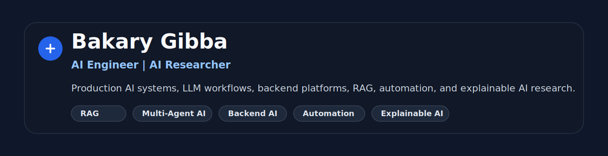
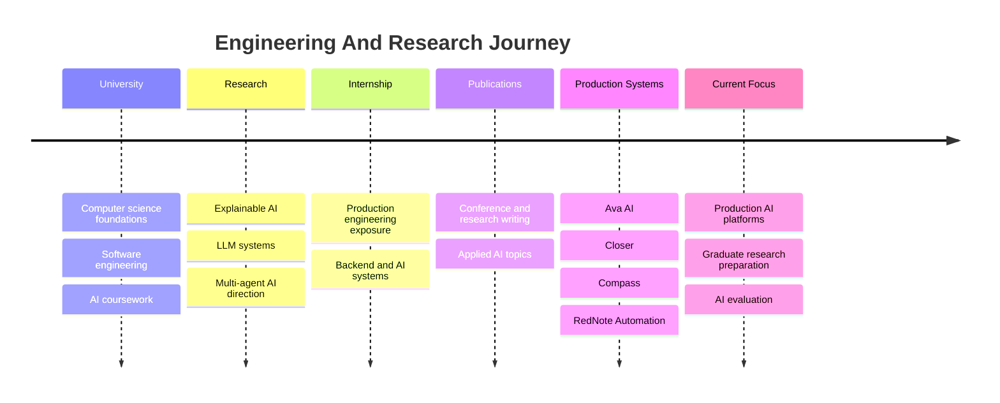
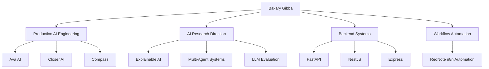

# Bakary Gibba

**AI Engineer | AI Researcher**

I build production-oriented AI systems that connect LLMs, backend platforms, retrieval workflows, automation, and human-centered product design. My work focuses on practical AI applications: HR assistants, sales copilots, content intelligence systems, and safe automation workflows.

This repository is the central navigation hub for my engineering and research portfolio.

## Professional Links

| Link | URL |
| --- | --- |
| GitHub | [github.com/BakaryGibba](https://github.com/BakaryGibba) |
| Portfolio | Add portfolio URL |
| LinkedIn | Add LinkedIn URL |
| Google Scholar | Add Google Scholar URL |
| ResearchGate | Add ResearchGate URL |
| CV | Add CV URL |

## About Me

I am an AI engineer and researcher interested in building reliable AI systems that can move from prototype to production. My engineering work sits at the intersection of backend architecture, LLM applications, retrieval-augmented generation, agentic workflows, automation, and product-facing AI.

My research interests include multi-agent systems, explainable AI, LLM evaluation, AI safety, and applied AI for decision support. Healthcare AI is one specialization within that broader research path, alongside enterprise assistants, knowledge systems, and workflow automation.

## Career Snapshot

| Area | Snapshot |
| --- | --- |
| Production AI systems | HR assistant, sales copilot, content intelligence workspace, automation platform |
| Case studies | 4 professional engineering case studies |
| AI patterns | RAG, LLM orchestration, realtime coaching, AI-assisted workflow automation |
| Backend stacks | FastAPI, NestJS, Express, Node.js, Python, TypeScript |
| Frontend stacks | React, TanStack Router, Vite, Tailwind CSS, Electron |
| Data and retrieval | PostgreSQL-style schemas, Qdrant, local artifact pipelines, structured logs |
| Automation | n8n, Playwright, Appium, workflow routing, attended RPA |
| Research direction | LLM systems, multi-agent AI, explainability, evaluation, AI safety |

## Engineering Journey

See the expanded timeline in [timeline/README.md](timeline/README.md).

## Portfolio Map

## Featured Engineering Portfolio

### Compass Content Trend Radar

| Field | Summary |
| --- | --- |
| Overview | Content intelligence workspace that turns client profiles, search trends, TikTok signals, SEO research, and brand rules into weekly content plans |
| Tech Stack | FastAPI, React, TanStack, Vite, Tailwind, pytrends, OpenAI-compatible AI, Pusher |
| Problem | Content teams need repeatable strategy workflows instead of scattered manual trend research |
| Solution | Guided workflow from client profile to keywords, ideas, briefs, weekly board, and reports |
| Key Contributions | Architecture, collector workflows, scoring, strategy pipeline, frontend workspace, documentation |
| Engineering Highlights | Source status visibility, rule-based fallback, local artifact debugging, client-scoped strategy |
| Lessons Learned | Content AI needs explainability, source transparency, and human approval more than raw generation |
| Repository | [compass-content-trend-radar-case-study](https://github.com/BakaryGibba/compass-content-trend-radar-case-study) |
| Documentation | [Case study README](https://github.com/BakaryGibba/compass-content-trend-radar-case-study#readme) |
| Status | Portfolio case study ready |

### Ava AI

| Field | Summary |
| --- | --- |
| Overview | AI-powered HR assistant for employee support, HR admin review, document-grounded answers, and governance |
| Tech Stack | React, TanStack, NestJS, PostgreSQL-style data, Qdrant, OpenAI, Gemini, Socket.IO |
| Problem | HR teams need scalable, confidential support across policies, leave, payroll, benefits, claims, and procedures |
| Solution | RAG assistant with HRIS-aware context, realtime handover, admin review, and superadmin controls |
| Key Contributions | AI workflow, backend modules, retrieval design, HR handover, frontend role experiences |
| Engineering Highlights | Scoped retrieval, provider abstraction, usage governance, multi-role architecture |
| Lessons Learned | Enterprise AI assistants need trust boundaries, escalation, and operational monitoring |
| Repository | [ava-ai-case-study](https://github.com/BakaryGibba/ava-ai-case-study) |
| Documentation | [Case study README](https://github.com/BakaryGibba/ava-ai-case-study#readme) |
| Status | Portfolio case study ready |

### Closer AI

| Field | Summary |
| --- | --- |
| Overview | AI sales copilot for live client conversations, realtime transcription, RAG, and dashboard operations |
| Tech Stack | Electron, React, Express, Qdrant, Ollama, Gemini, OpenAI, Groq, realtime transcription |
| Problem | Sales teams need live coaching grounded in approved product knowledge and customer context |
| Solution | Desktop assistant plus admin dashboard for sessions, customers, documents, users, and KPIs |
| Key Contributions | Desktop workflow, live coaching architecture, RAG guardrails, dashboard operations |
| Engineering Highlights | Transparent overlay, retrieval grounding, false-claim correction, multi-provider AI |
| Lessons Learned | Live AI copilots require low-friction UX, strict guardrails, and reliable context flow |
| Repository | [closer-ai-sales-copilot-case-study](https://github.com/BakaryGibba/closer-ai-sales-copilot-case-study) |
| Documentation | [Case study README](https://github.com/BakaryGibba/closer-ai-sales-copilot-case-study#readme) |
| Status | Portfolio case study ready |

### RedNote Autoposting With n8n

| Field | Summary |
| --- | --- |
| Overview | Safe, attended multi-platform publishing automation for RedNote, TikTok, Instagram, Facebook, and LinkedIn |
| Tech Stack | n8n, Google Sheets, Google Drive, Node.js, Express, Playwright, Appium, WebdriverIO |
| Problem | Content teams lose time copying captions, downloading media, switching platforms, and tracking status manually |
| Solution | Queue-driven publishing workflow with direct API lanes and attended RPA lanes |
| Key Contributions | n8n orchestration, RPA service boundaries, mobile automation setup, safety runbooks |
| Engineering Highlights | Human-in-the-loop publishing, lane routing, status sync, no CAPTCHA or 2FA bypass |
| Lessons Learned | Reliable automation depends on safety stops, idempotency, and visible partial-failure handling |
| Repository | [rednote-n8n-autoposting-case-study](https://github.com/BakaryGibba/rednote-n8n-autoposting-case-study) |
| Documentation | [Case study README](https://github.com/BakaryGibba/rednote-n8n-autoposting-case-study#readme) |
| Status | Portfolio case study ready |

## Research Portfolio

| Area | Focus |
| --- | --- |
| LLM systems | Retrieval, orchestration, evaluation, prompt reliability, production constraints |
| Multi-agent systems | Task decomposition, agent coordination, tool use, memory, evaluation |
| Explainable AI | Interpretable decisions, user trust, transparent model behavior |
| AI safety | Human-in-the-loop review, escalation, guardrails, auditability |
| Applied AI | Enterprise assistants, content intelligence, sales enablement, healthcare AI specialization |

<strong>Publications And Research Links</strong>

Add verified publication links here:

| Type | Title | Venue | Link |
| --- | --- | --- | --- |
| Conference paper | Add title | Add venue | Add link |
| Journal article | Add title | Add venue | Add link |
| Preprint | Add title | arXiv or SSRN | Add link |

Profiles:

- Google Scholar: Add URL
- ResearchGate: Add URL
- arXiv: Add URL if available

## Technical Expertise

| Category | Tools And Topics |
| --- | --- |
| Programming | Python, TypeScript, JavaScript, SQL |
| AI engineering | LLM apps, RAG, embeddings, vector search, prompt engineering, evaluation, guardrails |
| Backend | FastAPI, NestJS, Express, REST APIs, WebSockets, service-oriented design |
| Frontend | React, TanStack Router, TanStack Query, Vite, Tailwind CSS, Electron |
| Automation | n8n, Playwright, Appium, WebdriverIO, attended RPA, workflow orchestration |
| Databases | PostgreSQL-style modeling, Qdrant, local artifact stores, structured data pipelines |
| DevOps | Git, environment management, logging, local deployment scripts, documentation workflows |
| Research | Explainability, multi-agent systems, AI safety, applied ML systems |

## Engineering Principles

I value systems that are useful, understandable, and maintainable.

- **Scalability:** Build boundaries that can grow from prototype to production.
- **Reliability:** Make failures visible and recoverable.
- **Maintainability:** Prefer clear service ownership and readable workflows.
- **Developer Experience:** Keep setup, diagnostics, and documentation practical.
- **AI Safety:** Use grounding, review states, escalation, and audit trails.
- **Research-Driven Engineering:** Treat evaluation and explanation as part of the product, not an afterthought.

## Current Focus

I am currently focused on:

- production AI platforms;
- LLM systems and backend AI infrastructure;
- multi-agent workflows and evaluation;
- RAG systems with governance and explainability;
- graduate research preparation in AI and applied machine learning.

## Repository Map

| Repository | Description | Purpose | Technology | Link |
| --- | --- | --- | --- | --- |
| `compass-content-trend-radar-case-study` | Content intelligence and strategy workspace | AI/product engineering case study | FastAPI, React, AI, trend collection | [Open](https://github.com/BakaryGibba/compass-content-trend-radar-case-study) |
| `ava-ai-case-study` | HR assistant with RAG, HRIS context, and governance | Enterprise AI assistant case study | NestJS, React, Qdrant, OpenAI, Gemini | [Open](https://github.com/BakaryGibba/ava-ai-case-study) |
| `closer-ai-sales-copilot-case-study` | Realtime sales copilot and dashboard | AI copilot case study | Electron, React, Express, Qdrant, Ollama | [Open](https://github.com/BakaryGibba/closer-ai-sales-copilot-case-study) |
| `rednote-n8n-autoposting-case-study` | Safe social publishing automation | Automation and RPA case study | n8n, Node.js, Playwright, Appium | [Open](https://github.com/BakaryGibba/rednote-n8n-autoposting-case-study) |

## Publications

Add verified publications here once final links are available.

| Publication | Topic | Link |
| --- | --- | --- |
| Add publication title | Add research area | Add link |

## Contact

For research supervision, AI engineering roles, collaborations, or technical interviews:

- GitHub: [github.com/BakaryGibba](https://github.com/BakaryGibba)
- Email: Add professional email
- LinkedIn: Add LinkedIn URL

> This repository is a curated engineering portfolio. It summarizes public, sanitized case studies and does not expose private source code, credentials, client data, or confidential implementation details.
