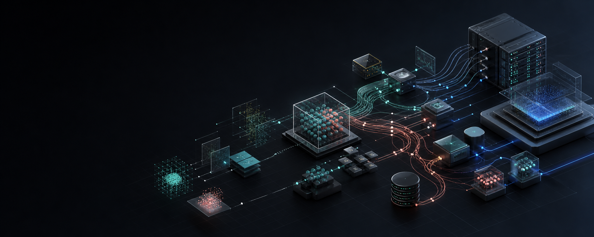
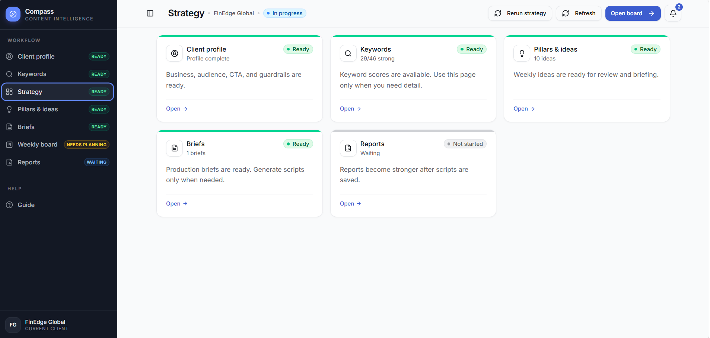
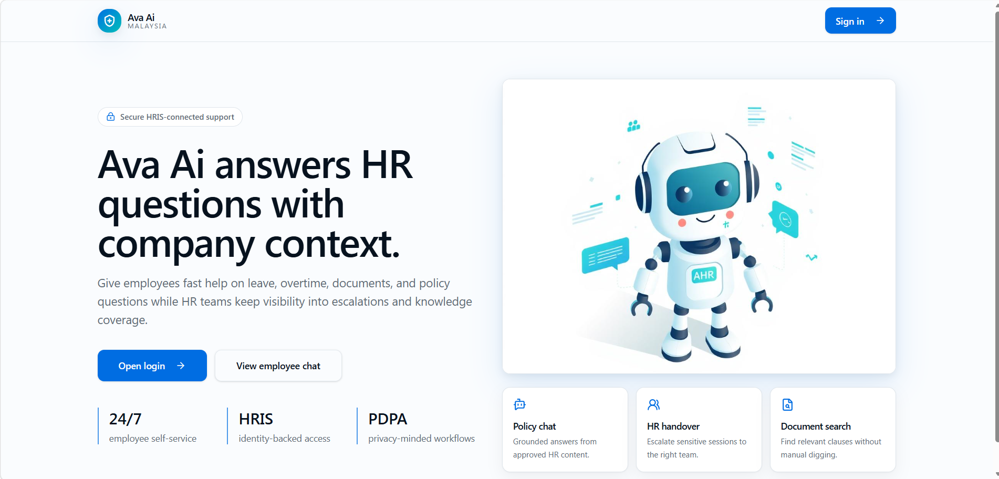
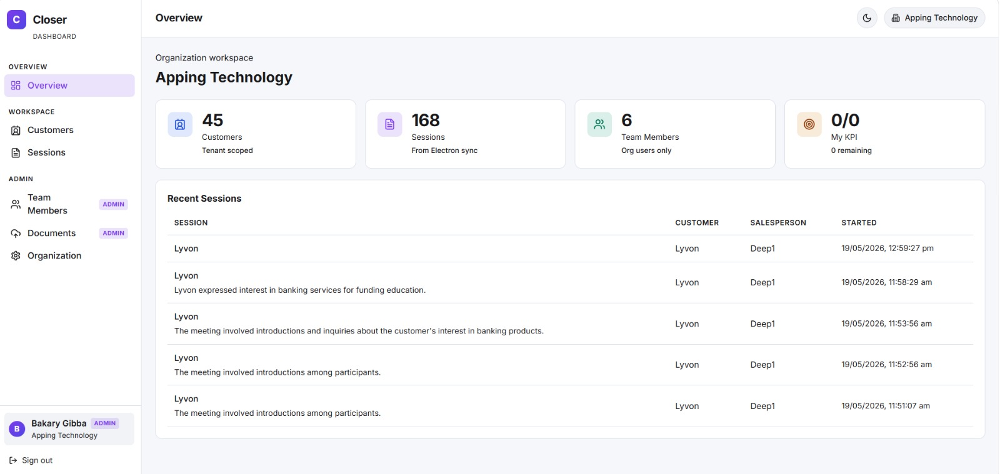
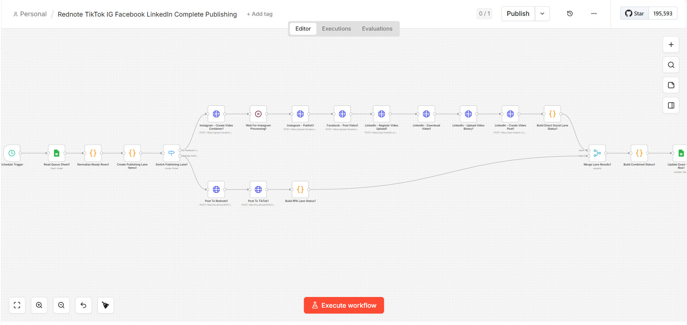
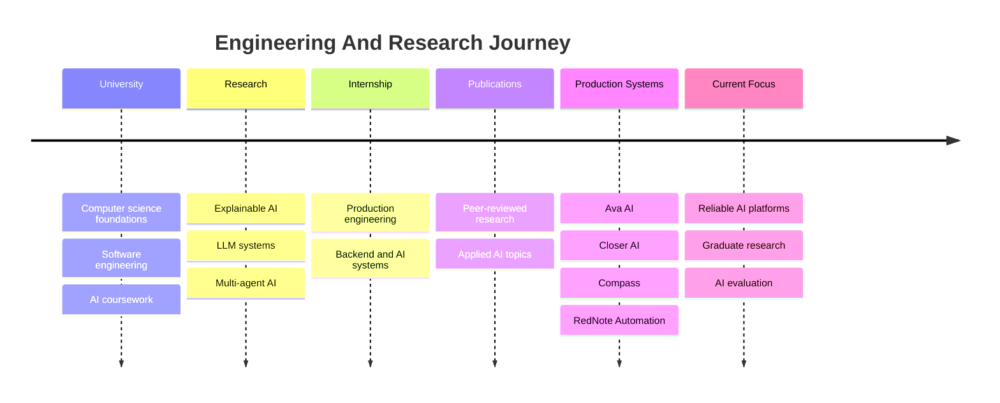
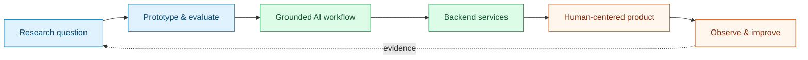

# Bakary Gibba

## AI Engineer · Applied AI Researcher

I design production AI systems where **LLMs, retrieval, backend architecture, automation, and human oversight** work as one dependable product.

Kuala Lumpur, Malaysia · [Email](mailto:bakarygibba055@gmail.com) · [ResearchGate](https://www.researchgate.net/profile/Bakary-Gibba?ev=hdr_xprf)

---

## At A Glance

| 4 production AI case studies | 7 selected publications & preprints | 4× Dean's List |
| :---: | :---: | :---: |
| RAG · agents · automation | XAI · computer vision · decision support | Fully funded scholar |

> [!NOTE]
> I bridge research and deployment: turning model capabilities into observable, explainable, and human-centered systems.

## Selected Systems

| [Compass](https://github.com/BakaryGibba/compass-content-trend-radar-case-study) | [Ava AI](https://github.com/BakaryGibba/ava-ai-case-study) |
| --- | --- |
|  |  |
| **Content intelligence** from trend signals to explainable weekly strategy. `FastAPI` `React` `LLMs` | **Enterprise HR assistant** with scoped RAG, HRIS context, governance, and human handover. `NestJS` `Qdrant` `React` |

| [Closer AI](https://github.com/BakaryGibba/closer-ai-sales-copilot-case-study) | [RedNote Automation](https://github.com/BakaryGibba/rednote-n8n-autoposting-case-study) |
| --- | --- |
|  |  |
| **Realtime sales copilot** grounded in approved product knowledge and customer context. `Electron` `Express` `Qdrant` | **Attended publishing automation** across API, browser, and mobile lanes. `n8n` `Playwright` `Appium` |

Each repository is a sanitized engineering case study covering architecture, trade-offs, workflows, screenshots, and lessons learned.

## Engineering And Research Journey

[Explore the expanded timeline →](timeline/README.md)

## From Research To Production

This loop shapes my work: evaluation is part of the architecture, not a final checkbox.

## Research Highlights

| Area | Selected evidence |
| --- | --- |
| Explainable AI | [Skin lesion classification with XAI — IEEE MECON 2025](https://doi.org/10.1109/MECON67253.2025.11277079) |
| Hybrid deep learning | [Lung cancer classification with DenseNet169 and SVM](https://arxiv.org/abs/2512.03359) |
| Medical image analysis | [Attention-enhanced U-Net for brain tumor segmentation](https://doi.org/10.48550/arXiv.2603.23344) |
| Multi-agent systems | Explainable resume–job matching using LLM-based agents — under review |

My broader research spans multi-agent systems, agentic AI, RAG reliability, explainability, human-centered AI, and intelligent decision support. See [Research Direction](docs/research-direction.md) for the complete narrative.

## Technical Core

| AI systems | Software systems | Research |
| --- | --- | --- |
| LLM applications, RAG, embeddings, vector search, agents, prompt design, evaluation, guardrails | Python, TypeScript, NestJS, FastAPI, Express, React, PostgreSQL, Qdrant, Docker, n8n | Explainable AI, deep learning, computer vision, SHAP, Grad-CAM, multi-agent evaluation |

## Recognition

| Scholarship | Academic | Research | Leadership |
| --- | --- | --- | --- |
| Albukhary Foundation fully funded scholar | Dean's List Award, 4× | Best Research Presenter, AIU Research Symposium | Maybank Global #MBassador |

## Explore The Portfolio

| Start here | Best for |
| --- | --- |
| [Engineering Case Studies](docs/engineering-case-studies.md) | Architecture, trade-offs, contributions, and lessons |
| [Research Direction](docs/research-direction.md) | Supervisors, research collaborators, and graduate review |
| [Technical Expertise](docs/technical-expertise.md) | Engineering interview and capability review |
| [Portfolio Strategy](docs/portfolio-strategy.md) | How the projects connect into one engineering narrative |
| [Review Guide](docs/review-guide.md) | A short route tailored to your role |
| [Academic CV](assets/Bakary-Gibba-Academic-CV.pdf) | Education, experience, publications, awards, and certifications |

<strong>Professional certifications</strong>

- [IBM AI Engineering Professional Certificate](https://coursera.org/share/2971849b4dcc213f24624bf6860905f5)
- [IBM Data Science Professional Certificate](https://coursera.org/share/a6820abec21898950687561b39da6be4)
- [IBM Data Analyst Professional Certificate](https://coursera.org/share/e610c8823218ce7ffe37fe73c335bbda)

---

### Open To Research And Engineering Conversations

[Email](mailto:bakarygibba055@gmail.com) · [LinkedIn](https://www.linkedin.com/in/bakary-gibba-6409bb248/) · [Google Scholar](https://scholar.google.com/citations?user=bp0G4sgAAAAJ&hl=en) · [ResearchGate](https://www.researchgate.net/profile/Bakary-Gibba?ev=hdr_xprf) · [Full CV](assets/Bakary-Gibba-Academic-CV.pdf)

*Public, sanitized portfolio material only. No credentials, client data, or proprietary source code are included.*

